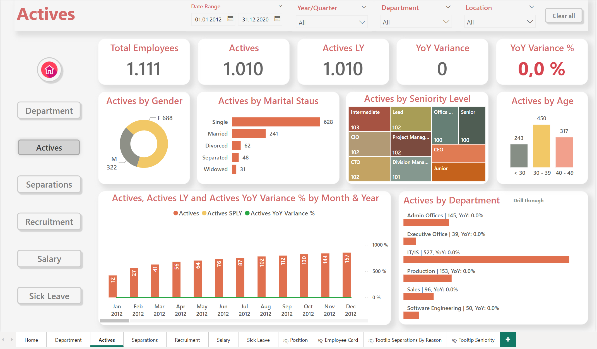
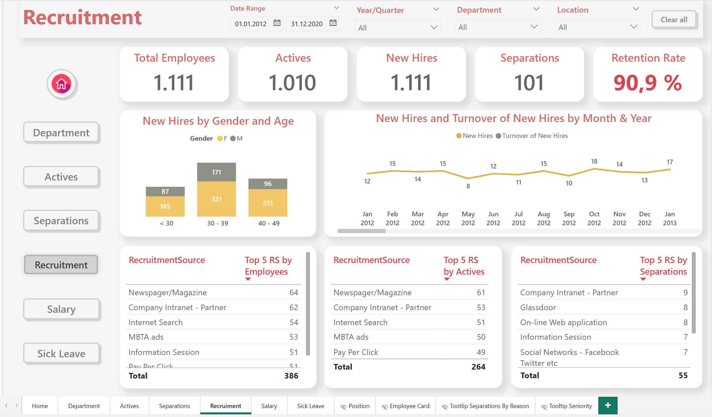
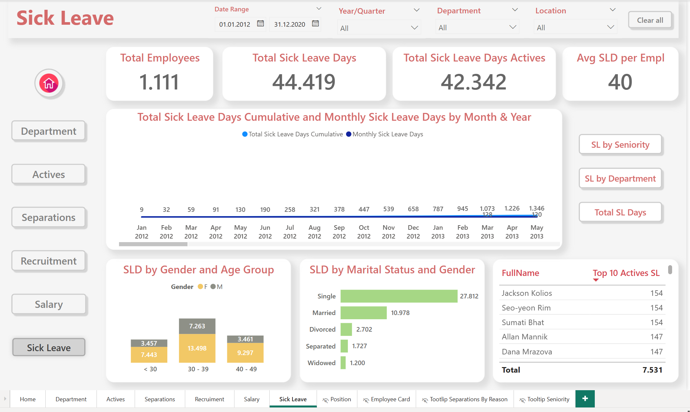
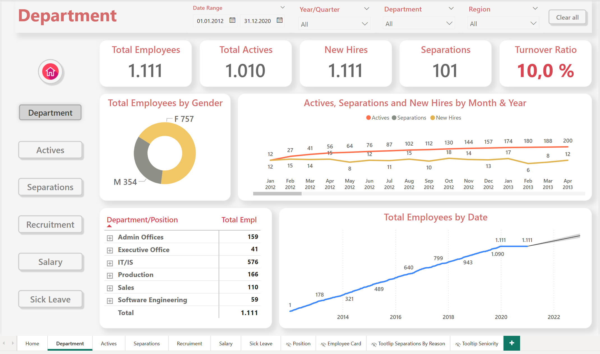

# HR Report Using Microsoft Power BI

This project showcases an advanced **HR Analytics Dashboard** built in **Power BI**, focusing on employee insights, recruitment metrics, and organizational structure.

---

## Overview

The report is based on a pre-processed and cleaned dataset stored in a **SQL Server database**, which was not included in the repository for confidentiality reasons. All transformation steps (data shaping, filtering, modeling) were done in **Power Query** and **SQL**, before building the visualizations in Power BI.

> Data Source: Cleaned internally using T-SQL  
> Period Covered: 2012–2020  
> Tool: Microsoft Power BI Desktop

---

## Report Features

- **Actives Overview**: Current employee breakdown by gender, age, marital status, and seniority level
- **Recruitment Analytics**: New hires, turnover rates, and top recruitment sources
- **Sick Leave**: Trends and departmental distribution
- **Salary Analysis**: Not publicly included, used for internal model verification
- **Navigation Panel**: Fully interactive with drill-through tooltips and page-level filters

---

## Screenshots

| Actives Dashboard | Recruitment Dashboard |
|-------------------|------------------------|
|  |  |

| Sick Leave Dashboard | Department Dashboard |
|-----------------------|---------------------|
|  |  |

---

## Disclaimer

**Data file not included**  
The dataset used in this project is not public. It was cleaned, filtered, and structured using SQL and is stored locally. The Power BI file (`.pbix`) uses this private source.

---

## Skills Demonstrated

- Power BI Desktop
- SQL Data Cleaning (T-SQL)
- DAX Calculations
- Visual Design and Interactivity
- Drill-through and Tooltip implementation

---

**Author**: Jasmina PZ  
[LinkedIn](https://www.linkedin.com/in/jasminapopovik)

